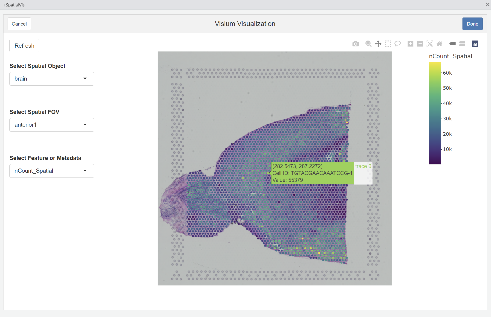

<!-- README.md is generated from README.Rmd. Please edit that file -->

# rspatialvis

<!-- badges: start -->
<!-- badges: end -->

rspatialvis is a RStudio addin built on plotly for interactively
visualizing spatial datasets quickly and easily.

## Installation

You can install the development version of rspatialvis like so:

``` r
install.packages("devtools")
devtools::install_github("chrisly-compbio/rspatialvis")
```

## Usage

Simply install the package, have a Seurat object in your environment,
and run the addin. Currently, only Seurat objects and Visium are
supported.


